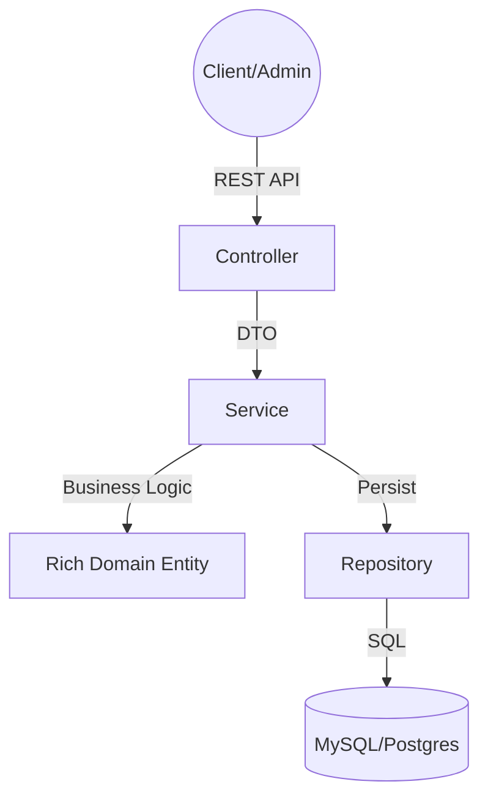

# 🛒 SmartShop API - B2B Management System

## 📄 Project Context
**SmartShop** is a robust B2B commercial management backend designed for **MicroTech Maroc**. It manages a portfolio of 650+ clients, handling complex order processing, inventory management, and financial traceability.

The system features a **dynamic loyalty engine**, **split-payment processing** (Cash/Check/Transfer), and strictly adheres to Moroccan financial regulations (e.g., 20,000 DH cash limit).

> **Note:** This project is a **Pure Backend REST API** (No frontend). Authentication is handled via **HTTP Session** (Stateful) as per project specifications.

---

## 🚀 Key Features

### 1. 👥 Advanced Client Management
* **Loyalty Tiers:** Automatic calculation of `BASIC`, `SILVER`, `GOLD`, and `PLATINUM` status based on turnover and order frequency.
* **Statistics:** Real-time tracking of `totalSpent` and `totalOrders`.
* **Security:** Role-based access (ADMIN vs CLIENT).

### 2. 📦 Inventory & Products
* **Soft Delete:** Products are marked `deleted` rather than removed, preserving historical order integrity.
* **Stock Management:** Automatic decrement upon order confirmation.

### 3. 💳 Complex Financial Engine
* **Split Payments:** An order can be paid via multiple methods (e.g., 40% Cash, 60% Check).
* **Validation:** System blocks confirmation until `Remaining Balance == 0`.
* **Legal Compliance:** Blocks Cash payments > 20,000 DH (Art. 193 CGI).

### 4. 🧮 Calculation Core
* **Pricing Chain:** `Subtotal` → `Tier Discount` → `Promo Code` → `Net HT` → `TVA (20%)` → `Total TTC`.
* **Precision:** All calculations use `BigDecimal` for financial accuracy.

---

## 🏗️ Technical Architecture

This project follows a **Layered Architecture** enhanced with **Rich Domain Models** (Tactical DDD) to ensure high cohesion and Separation of Concerns.

### Architecture Diagram
