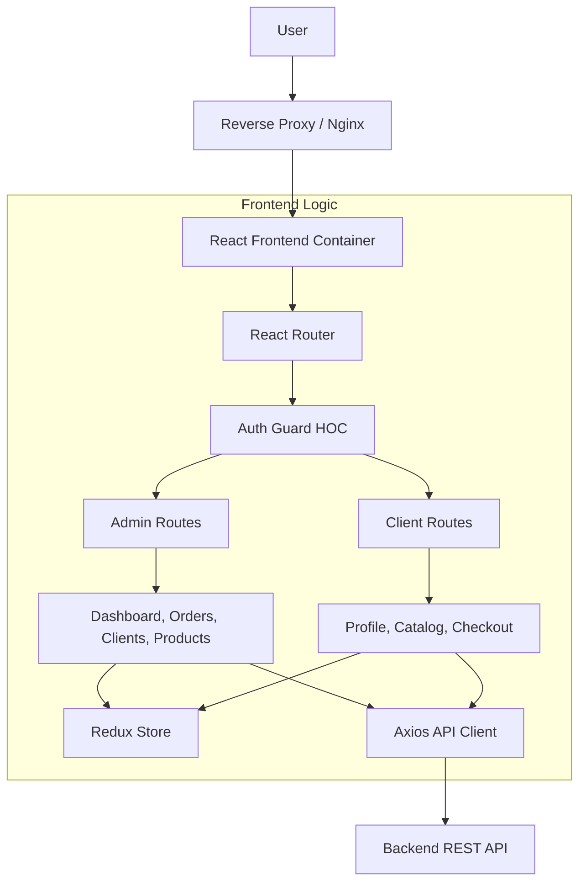

# SmartShop Frontend

## Project Overview
SmartShop Frontend is a React-based web application for managing B2B commercial operations. It connects to a robust Spring Boot backend to provide role-based access for Admins and Clients.

## Architecture
The application follows a modular structure using Feature-First organization where appropriate.



## Features

### Role Management
- **Admins**: Full control over Clients, Products, and Orders. Can create orders on behalf of clients.
- **Clients**: Self-service portal to view catalog, manage profile, and place orders via a Shopping Cart.

### Key Components
- **State Management**: Redux Toolkit used for Authentication and Cart management.
- **Forms**: React Hook Form for efficient validation and state handling.
- **Styling**: TailwindCSS for responsive and modern UI.

## Getting Started

### Prerequisites
- Node.js 18+
- Docker (optional)

### Installation
```bash
npm install
```

### Running Locally
```bash
npm run dev
```

### Running Tests
- Unit Tests: `npm run test`
- E2E Tests: `npm run test:e2e` (Requires backend running or mock)

### Docker Deployment
```bash
# Build Image
docker build -t smartshop-frontend .

# Run Container
docker run -p 8080:80 smartshop-frontend
```

## Implementation Details for Review
- **Cart Logic**: See `src/store/slices/cartSlice.ts`
- **Client Checkout**: See `src/pages/client/CheckoutPage.tsx`
- **DevOps**: See `Dockerfile` and `nginx.conf`
